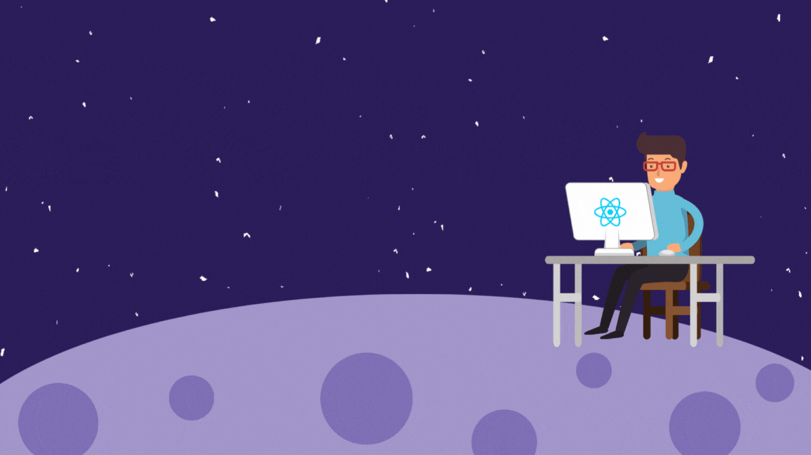

  
<h1 align="center">Hi 👋, I'm Soumya Sachin Panda</h1>
<h3 align="center">A full-stack web developer from India</h3>

  

  

- 🔭 I’m currently working on [Animick](https://animick.netlify.app/)

- 🌱 I’m currently learning **React , Redux**

- 👯 I’m looking to collaborate on **Interesting Projects**

- 👨‍💻 All of my projects are available at [https://soumyasachin.netlify.app/](https://soumyasachin.netlify.app/)

- 📝 I regularly write articles on [https://medium.com/@pandasoumyasachin](https://medium.com/@pandasoumyasachin)

- 💬 Ask me about **HTML , CSS , Bootstrap, Tailwind, JavaScript, React ,Nodejs , Java and Mongodb**

- 📫 How to reach me **pandasoumyasachin@gmail.com**

- 📄View my resume [https://drive.google.com/file/d/1bq_AFpuQZW9oirgDvz57OAty2MAwASDE/view?usp=sharing](https://drive.google.com/file/d/1bq_AFpuQZW9oirgDvz57OAty2MAwASDE/view?usp=sharing)

- ⚡ Fun fact **I think I am funny**

<h3 align="left">Connect with me:</h3>

<h3 align="left">Languages and Tools:</h3>

                  

&nbsp;

